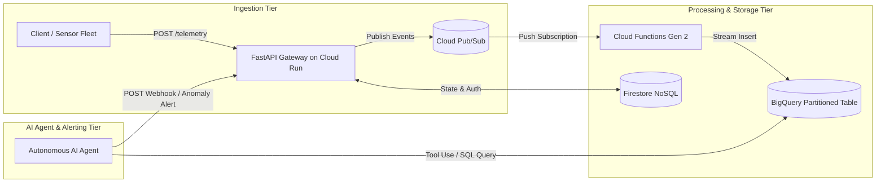

# Serverless Event-Driven Data Pipeline
A scale-to-zero event streaming backend and autonomous telemetry observability platform built on Google Cloud Platform (GCP). The system ingests high-velocity distributed telemetry via asynchronous message buffering, processes real-time events into a partitioned BigQuery data warehouse, and integrates an autonomous Gemini AI agent utilizing tool-calling to evaluate logs and dynamically resolve errors.

## System Architecture & Tech Stack

## Core API Endpoints
1. Health & Probes
   - GET / : System Status Probe
   - GET / health/liveness : Instance liveness check
   - GET / health/readiness : Verifies database connection and availability

2. Event Telemetry Stream
   - POST /telemetry : Ingests individual real time events and buffers to Pub/Sub
   - POST /telemetry/batch : Takes in events grouped in bulk

3. Analytics & Operational Alerts
   - GET /analytics/device-breakdown : Retrieves analytical info previously aggragated
   - POST /api/system/alerts : Receives automated alerts from the autonomous AI agent

4. User Profile Management
   - POST /api/users/{user_id} : Creates a structured profile
   - GET /api/users/{user_id} : Retrieves profile
   - PUT /api/users/{user_id} : Updates profile info
   - DELETE /api/users/{user_id} : Deletes profile

## Infrastructure as Code & CI/CD
All core cloud infrastructure is declared programmatically in /terraform:
   - pubsub.tf : Provisions ingestion topics for Pub/Sub
   - bigquery.tf : Defines Partitioned (DAY) and clustered (device_type, event_type)
                   data tables
   - cloud_run.tf : manages IAM permissions, autoscaling and container runtime
   - ci.yml : Automated Github Actions pipeline runs tests with every pull request and push
              to ensure changes do not break the fundamental infrastructure.

## Local Development Setup
1. Clone & Set Up Environment

git clone [https://github.com/trailblazer24/serverless-api.git](https://github.com/trailblazer24/serverless-api.git)
cd serverless-api
python -m venv venv

On Windows: source venv/Scripts/activate 
On Linux/MacOS : source venv/bin/activate

pip install -r requirements.txt

2. Run Isolated Unit Tests
python -m pytest -v

3. Run Application Locally
uvicorn main:app --reload --port 8080

4. Run With Docker
docker build -t serverless-api:local .
docker run -p 8080:8080 serverless-api:local